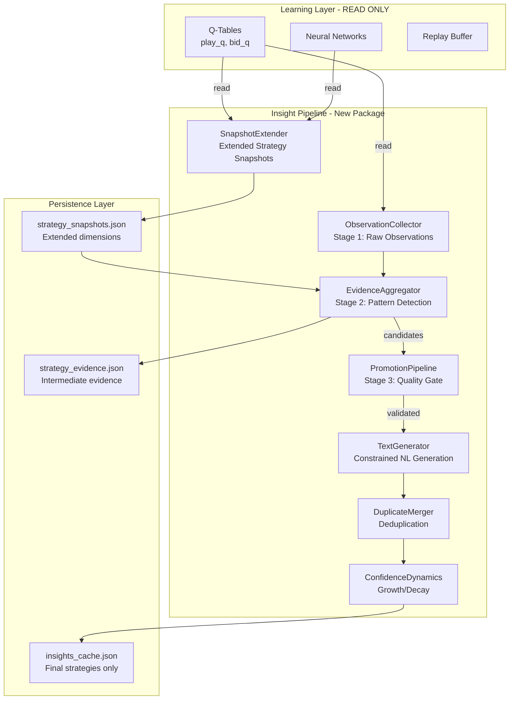
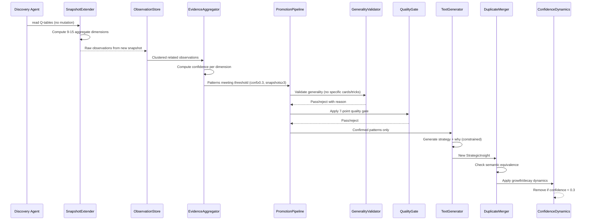

# Design Document: Strategic Insight Hierarchy

## Overview

This design refactors the Wist insight system (`gui_wist_discovery/insights.py`) into a principled multi-stage pipeline that transforms raw Q-table observations into validated, general strategic insights. The current system directly mines Q-tables and produces single-play observations (e.g., "Queen of clubs beats all alternatives in trick 4") that pollute `insights_cache.json`. The new architecture introduces a strict hierarchy: **raw observation → repeated pattern → strategic insight**, with an intermediate evidence aggregation layer (`strategy_evidence.json`) separating statistical detection from natural-language generation.

### Key Design Decisions

1. **New module, not inline refactor**: The pipeline lives in a new `agents/wist_discovery/insight_pipeline/` package rather than continuing to grow `gui_wist_discovery/insights.py`. The GUI module becomes a thin consumer.
2. **Read-only access to learning data**: The pipeline reads Q-tables, experience data, and training statistics but never modifies them (Requirement 12).
3. **Evidence-first architecture**: No text is generated until the statistical layer confirms a pattern meets confidence and repetition thresholds.
4. **Backward compatibility**: The existing `strategy_snapshots.json` fields (`pos_prefs`, `suit_prefs`, `bid_prefs`, `rank_prefs`) remain unchanged; new aggregate dimensions are added alongside them.

## Architecture



### Pipeline Execution Order

```
Q-table learned values
  → strategy_snapshots.json (extended with new dimensions)
  → ObservationCollector (raw observations, internal store)
  → EvidenceAggregator (pattern/evidence aggregation → strategy_evidence.json)
  → Strategy candidates
  → PromotionPipeline (quality gate, generality validation)
  → TextGenerator (constrained NL)
  → DuplicateMerger (dedup + merge)
  → ConfidenceDynamics (growth/decay)
  → insights_cache.json
```

## Components and Interfaces

### Package Structure

```
agents/wist_discovery/insight_pipeline/
├── __init__.py                 # Public API: run_insight_cycle()
├── observation_store.py        # ObservationStore class
├── snapshot_extender.py        # SnapshotExtender class
├── evidence_aggregator.py      # EvidenceAggregator class
├── promotion_pipeline.py       # PromotionPipeline + QualityGate
├── text_generator.py           # TextGenerator class
├── duplicate_merger.py         # DuplicateMerger class
├── confidence_dynamics.py      # ConfidenceDynamics class
├── schema.py                   # Dataclasses, validation, constants
├── generality_validator.py     # GeneralityValidator class
└── migration.py                # Counter-intuitive migration logic
```

### Key Classes and Functions

```python
# schema.py
@dataclass
class RawObservation:
    """A single game-event record from one episode."""
    category: str                    # Strategic dimension
    game_phase: str                  # early/mid/late
    dimension_key: str               # e.g., "pos_leading_high"
    reward_direction: str            # positive/negative
    state_context: dict              # Abstract state features
    episode: int                     # Source episode number
    snapshot_id: str                 # Which snapshot produced this
    timestamp: float                 # When recorded

@dataclass
class RepeatedPattern:
    """A cluster of related observations that recur across states."""
    category: str
    dimension_key: str
    observations: list[RawObservation]
    observation_count: int
    distinct_states: int             # Number of distinct game states
    distinct_snapshots: int          # Number of training snapshots
    confidence: float                # 0.0-1.0
    contradicting_count: int         # Counter-evidence
    stage: str = "pattern"           # Pipeline stage label

@dataclass
class StrategicInsight:
    """Final validated insight for persistence."""
    strategy: str                    # Max 200 chars
    category: str                    # From VALID_CATEGORIES
    tags: list[str]                  # Max 5 tags, each max 30 chars
    confidence: float                # 0.0-1.0
    evidence_count: int              # Min 1
    why: str                         # Max 500 chars, quantitative
    first_seen: int                  # Episode number
    last_confirmed: int              # Episode number >= first_seen
    new: bool                        # True on first cycle

VALID_CATEGORIES = frozenset([
    "leading", "following", "position", "card_preservation",
    "suit_management", "trump_management", "bidding", "defense",
    "partner_play", "risk", "information", "endgame", "surprising_pattern"
])

REJECTION_REASONS = [
    "literal_trick_number", "specific_player", "named_card",
    "single_episode", "insufficient_pattern_support"
]
```

```python
# observation_store.py
class ObservationStore:
    """Internal store for raw observations, separate from insights_cache."""
    
    def __init__(self, max_capacity: int = 10000):
        ...
    
    def record(self, observation: RawObservation) -> None:
        """Store a raw observation for pattern detection."""
        ...
    
    def get_related(self, category: str, game_phase: str,
                    min_count: int = 3) -> list[list[RawObservation]]:
        """Find clusters of related observations."""
        ...
    
    def consume(self, observations: list[RawObservation]) -> None:
        """Mark observations as consumed by the aggregation process."""
        ...
```

```python
# snapshot_extender.py
class SnapshotExtender:
    """Extends strategy snapshots with new aggregate behaviour dimensions."""
    
    MIN_CONTRIBUTING_STATES = 5  # Below this, dimension = null
    
    def take_extended_snapshot(self, agent) -> dict:
        """Read Q-tables and compute all dimensions (existing + new).
        
        New dimensions:
        - leading_vs_following: position 0 vs positions 1-3
        - early_mid_late: hand size 10-13 / 5-9 / 1-4
        - card_strength_by_role: tier usage while leading vs following
        - trump_vs_nontrump: trump plays vs off-suit plays
        - partner_vs_opponent_winning: partner ahead vs opponent ahead
        - suit_length: long (4+) / short (2-3) / void (0)
        - information_available: cards played in trick (0-3)
        - bid_strength_reliability: bid level vs bid met ratio
        - defensive_vs_attacking: opponent holds vs own team holds
        """
        ...
```

```python
# evidence_aggregator.py
class EvidenceAggregator:
    """Aggregates observations into pattern candidates."""
    
    CONFIDENCE_THRESHOLD = 0.3
    MIN_SNAPSHOTS = 3
    
    def aggregate(self, observations: list[RawObservation],
                  snapshots: dict) -> list[RepeatedPattern]:
        """Group observations by dimension, compute confidence,
        return patterns meeting promotion thresholds."""
        ...
    
    def persist_evidence(self, patterns: list[RepeatedPattern]) -> None:
        """Write current evidence state to strategy_evidence.json."""
        ...
```

```python
# promotion_pipeline.py
class PromotionPipeline:
    """Three-stage pipeline: observation → pattern → insight."""
    
    def promote_observations_to_patterns(
        self, store: ObservationStore
    ) -> list[RepeatedPattern]:
        """Promote when ≥3 related observations across ≥2 game states."""
        ...
    
    def promote_patterns_to_insights(
        self, patterns: list[RepeatedPattern],
        quality_gate: QualityGate,
        generality_validator: GeneralityValidator,
        existing_insights: list[StrategicInsight]
    ) -> tuple[list[StrategicInsight], list[dict]]:
        """Apply quality gate + generality checks.
        Returns (promoted, rejected_with_reasons)."""
        ...


class QualityGate:
    """Validates candidates before promotion to insights_cache."""
    
    TEXT_SIMILARITY_THRESHOLD = 0.8  # 80% token overlap = duplicate
    
    def validate(self, candidate: StrategicInsight,
                 existing: list[StrategicInsight]) -> tuple[bool, str | None]:
        """Returns (passes, rejection_reason_or_none).
        
        Checks:
        1. Evidence from ≥3 distinct episodes
        2. Applies to ≥2 distinct game states
        3. References recurring condition (not fixed card combo)
        4. Has causal reason (non-empty why referencing game mechanic)
        5. No >80% text similarity with existing insight
        6. Surprising patterns contradict default expectation
        7. Reason references learned evidence
        """
        ...
```

```python
# generality_validator.py
class GeneralityValidator:
    """Ensures insights don't reference specific game-state identifiers."""
    
    # Patterns that indicate non-general content
    TRICK_NUMBER_PATTERN = re.compile(r'\btrick\s+\d+\b', re.IGNORECASE)
    PLAYER_INDEX_PATTERN = re.compile(r'\bplayer\s+\d+\b', re.IGNORECASE)
    NAMED_CARD_PATTERN = re.compile(
        r'\b(ace|king|queen|jack|[2-9]|10)\s+of\s+(spades|hearts|clubs|diamonds)\b',
        re.IGNORECASE
    )
    EPISODE_PATTERN = re.compile(r'\bepisode\s+\d+\b', re.IGNORECASE)
    HAND_ID_PATTERN = re.compile(r'\bhand\s+#?\d+\b', re.IGNORECASE)
    
    def validate(self, text: str, evidence_count: int,
                 distinct_states: int) -> tuple[bool, str | None]:
        """Returns (passes, rejection_reason_or_none)."""
        ...
```

```python
# text_generator.py
class TextGenerator:
    """Constrained natural-language generation for strategies."""
    
    FORBIDDEN_QUALIFIERS = {"brilliant", "optimal", "perfect", "amazing",
                            "incredible", "genius", "unbelievable"}
    MAX_STRATEGY_LENGTH = 200
    MAX_WHY_LENGTH = 500
    
    def generate(self, pattern: RepeatedPattern) -> tuple[str, str] | None:
        """Generate (strategy_text, why_text) from a confirmed pattern.
        
        Returns None if pattern hasn't passed statistical confirmation.
        The 'why' must include quantitative reference (evidence_count,
        effect size, or consistency measure).
        """
        ...
```

```python
# duplicate_merger.py
class DuplicateMerger:
    """Merges semantically equivalent strategies."""
    
    def merge_if_duplicate(self, candidate: StrategicInsight,
                           existing: list[StrategicInsight]
                           ) -> StrategicInsight | None:
        """If candidate is semantically equivalent to an existing insight,
        merge and return the updated existing insight.
        Returns None if no duplicate found (candidate is new).
        
        Semantic equivalence: same category + overlapping tags +
        same core strategic advice (>80% token overlap).
        
        Merge rules:
        - Confidence += candidate evidence weight (cap at 1.0)
        - evidence_count += candidate.evidence_count
        - last_confirmed = candidate's episode
        """
        ...
```

```python
# confidence_dynamics.py
class ConfidenceDynamics:
    """Manages confidence growth and decay over time."""
    
    CONFIDENCE_THRESHOLD = 0.3  # Below this = removed from cache
    SURPRISING_MIN_EVIDENCE = 10
    SURPRISING_MIN_STATES = 3
    SURPRISING_MIN_SNAPSHOTS = 2
    SURPRISING_MIN_SUPPORT_RATIO = 2.0  # 2:1 supporting vs contradicting
    
    def apply_supporting_evidence(self, insight: StrategicInsight,
                                  total_observations: int) -> None:
        """Increase confidence by 1/total_observations."""
        ...
    
    def apply_contradicting_evidence(self, insight: StrategicInsight,
                                     total_observations: int) -> None:
        """Recalculate confidence = supporting / total."""
        ...
    
    def should_remove(self, insight: StrategicInsight) -> bool:
        """True if confidence < CONFIDENCE_THRESHOLD."""
        ...
    
    def validate_surprising_pattern(self, pattern: RepeatedPattern) -> bool:
        """Apply all 6 criteria from Requirement 4."""
        ...
```

```python
# __init__.py - Public API
def run_insight_cycle(agent, current_episode: int) -> list[StrategicInsight]:
    """Execute one full insight generation cycle.
    
    1. Take extended snapshot (if interval reached)
    2. Collect raw observations from Q-tables
    3. Aggregate evidence
    4. Promote patterns through pipeline
    5. Generate text for promoted patterns
    6. Merge duplicates
    7. Apply confidence dynamics
    8. Migrate legacy counter-intuitive entries
    9. Persist results
    
    Returns: updated list of insights in insights_cache.json
    """
    ...
```

### Data Flow Between Components



## Data Models

### `insights_cache.json` — Revised Schema (Requirement 7)

```json
[
  {
    "strategy": "In late-game positions with few cards remaining, leading with trump forces opponents to either follow with their remaining trump or lose the trick",
    "category": "trump_management",
    "tags": ["leading", "endgame", "trump_management"],
    "confidence": 0.72,
    "evidence_count": 47,
    "why": "Observed across 47 game states: leading trump in late phase (hand size 1-4) wins the trick 78% of the time vs 45% for non-trump leads (effect size: +33%)",
    "first_seen": 50000,
    "last_confirmed": 120000,
    "new": false
  }
]
```

**Field Constraints:**
| Field | Type | Constraints |
|-------|------|-------------|
| `strategy` | string | Max 200 characters |
| `category` | string | One of 13 VALID_CATEGORIES |
| `tags` | list[string] | Max 5 items, each max 30 chars, lowercase + underscores only |
| `confidence` | float | 0.0–1.0 inclusive |
| `evidence_count` | integer | ≥ 1 |
| `why` | string | Max 500 chars, must reference quantitative evidence |
| `first_seen` | integer | Episode number ≥ 0 |
| `last_confirmed` | integer | Episode number ≥ first_seen |
| `new` | boolean | True only during first cycle after creation |

### `strategy_evidence.json` — Intermediate Evidence Layer

```json
{
  "patterns": [
    {
      "dimension_key": "leading_high_card_late_phase",
      "category": "leading",
      "stage": "pattern",
      "observation_count": 24,
      "distinct_states": 8,
      "distinct_snapshots": 3,
      "confidence": 0.65,
      "contradicting_count": 4,
      "reward_direction": "positive",
      "first_observed_episode": 50000,
      "last_observed_episode": 120000,
      "supporting_snapshot_ids": ["50000", "100000", "150000"]
    }
  ],
  "raw_observations": [
    {
      "category": "leading",
      "game_phase": "late",
      "dimension_key": "leading_high_card_late_phase",
      "reward_direction": "positive",
      "state_context": {"hand_size": "late", "position": "leading"},
      "episode": 115000,
      "snapshot_id": "100000"
    }
  ],
  "metadata": {
    "last_processed_episode": 120000,
    "total_observations_recorded": 1542,
    "total_patterns_detected": 23,
    "total_promotions": 8
  }
}
```

### `strategy_snapshots.json` — Extended Schema (Requirement 8)

Existing fields preserved unchanged:
```json
{
  "150000": {
    "1": {
      "pos_prefs": { ... },
      "suit_prefs": { ... },
      "bid_prefs": { ... },
      "rank_prefs": { ... },
      "leading_vs_following": {
        "leading": {"mean_q": 2.3, "count": 450},
        "following": {"mean_q": -0.8, "count": 1200}
      },
      "phase_behaviour": {
        "early": {"mean_q": 0.5, "count": 300},
        "mid": {"mean_q": 1.2, "count": 600},
        "late": {"mean_q": 2.8, "count": 250}
      },
      "card_strength_by_role": {
        "leading_high": {"mean_q": 3.1, "count": 120},
        "leading_low": {"mean_q": -0.3, "count": 180},
        "following_high": {"mean_q": 1.8, "count": 200},
        "following_low": {"mean_q": -1.2, "count": 350}
      },
      "trump_vs_nontrump": {
        "trump": {"mean_q": 2.5, "count": 180},
        "nontrump": {"mean_q": 0.3, "count": 970}
      },
      "partner_vs_opponent_winning": {
        "partner_winning": {"mean_q": 0.8, "count": 320},
        "opponent_winning": {"mean_q": 1.6, "count": 410}
      },
      "suit_length": {
        "long": {"mean_q": 1.1, "count": 250},
        "short": {"mean_q": 0.4, "count": 400},
        "void": {"mean_q": 2.0, "count": 50}
      },
      "information_available": {
        "0": {"mean_q": 0.9, "count": 300},
        "1": {"mean_q": 1.0, "count": 350},
        "2": {"mean_q": 1.3, "count": 280},
        "3": {"mean_q": 1.8, "count": 220}
      },
      "bid_strength_reliability": {
        "bid_level": {"mean_q": -5.2, "count": 80},
        "reliability_ratio": 0.73
      },
      "defensive_vs_attacking": {
        "defensive": {"mean_q": -0.4, "count": 380},
        "attacking": {"mean_q": 1.9, "count": 520}
      }
    }
  }
}
```

**Constraints:**
- 9–15 top-level dimension keys per snapshot (excluding `pos_prefs`, `suit_prefs`, `bid_prefs`, `rank_prefs`)
- Each dimension entry contains at minimum `mean_q` (float) and `count` (int)
- If `count < 5`, the dimension value is `null`
- Snapshot write completes within 5 seconds for Q-tables up to 30,000 entries

### Internal Observation Store (in-memory with optional persistence)

```python
# Not persisted to insights_cache.json — internal only
_observation_store: dict[str, list[RawObservation]] = {
    "leading": [...],
    "following": [...],
    "position": [...],
    ...
}
```

Max capacity: 10,000 observations. When full, oldest observations are evicted (FIFO per category).

## Correctness Properties

*A property is a characteristic or behavior that should hold true across all valid executions of a system — essentially, a formal statement about what the system should do. Properties serve as the bridge between human-readable specifications and machine-verifiable correctness guarantees.*

### Property 1: Generality Invariant

*For any* strategic insight persisted to `insights_cache.json`, its `strategy` text SHALL NOT contain a literal trick number (e.g., "trick 3"), a specific player index (e.g., "player 2"), a named individual card (e.g., "Queen of clubs"), a hand identifier (e.g., "hand #5"), or a training episode number (e.g., "episode 1000"). The GeneralityValidator must reject any candidate whose text matches these patterns.

**Validates: Requirements 1.2, 1.5, 2.1, 2.2, 2.3, 2.4, 2.6**

### Property 2: Observation Separation

*For any* raw observation recorded by the ObservationStore, that observation SHALL NOT appear as an entry in `insights_cache.json`. The internal observation store and the final insight cache are disjoint data structures with no direct content sharing.

**Validates: Requirements 1.1, 1.3**

### Property 3: Minimum Observation Threshold for Pattern Promotion

*For any* set of related observations sharing the same category and game-phase context, if the count is fewer than 3 observations OR the observations come from fewer than 2 distinct game states, THEN no strategic insight SHALL be created from them in `insights_cache.json`.

**Validates: Requirements 1.4, 13.3**

### Property 4: Category Validity Invariant

*For any* strategic insight persisted to `insights_cache.json`, its `category` field SHALL be exactly one value from the set {leading, following, position, card_preservation, suit_management, trump_management, bidding, defense, partner_play, risk, information, endgame, surprising_pattern}. The value "counter-intuitive" SHALL NOT appear as a category in the persisted output.

**Validates: Requirements 3.1, 3.2, 3.5, 5.1**

### Property 5: Tag Constraint Invariant

*For any* strategic insight persisted to `insights_cache.json`, the `tags` list SHALL contain at most 5 elements, each element SHALL be a lowercase string containing only letters and underscores, and each element SHALL be at most 30 characters in length.

**Validates: Requirements 3.3**

### Property 6: Surprising Pattern Threshold Invariant

*For any* insight classified with category "surprising_pattern" in `insights_cache.json`, it SHALL have been observed across at least 3 distinct comparable game states, across at least 2 distinct training snapshots separated by at least 1000 episodes, with an evidence_count of at least 10, and a support-to-contradiction ratio of at least 2:1.

**Validates: Requirements 4.1, 4.2, 4.3, 4.6, 4.7**

### Property 7: Schema Completeness Invariant

*For any* entry persisted to `insights_cache.json`, it SHALL contain all of: `strategy` (string, max 200 chars), `category` (string from valid set), `tags` (list of strings), `confidence` (float 0.0–1.0), `evidence_count` (integer ≥ 1), `why` (string, max 500 chars), `first_seen` (integer ≥ 0), `last_confirmed` (integer ≥ first_seen), `new` (boolean). Any entry missing a field or with an out-of-bounds value SHALL NOT be persisted.

**Validates: Requirements 7.1, 7.6**

### Property 8: Confidence Range Invariant

*For any* strategic insight at any point in the pipeline (creation, merge, growth, decay), its `confidence` field SHALL be within the range [0.0, 1.0] inclusive. If a merge or growth operation would produce a value exceeding 1.0, the result SHALL be capped at 1.0.

**Validates: Requirements 14.5, 6.2, 6.6**

### Property 9: Merge Evidence Accumulation

*For any* merge of a candidate insight into an existing insight (same category, overlapping tags, semantic equivalence), the resulting entry's `evidence_count` SHALL equal the sum of both entries' evidence counts, and `last_confirmed` SHALL equal the candidate's episode number.

**Validates: Requirements 6.3, 6.4**

### Property 10: Confidence Growth from Supporting Evidence

*For any* new supporting observation matching an existing strategy's state-action-outcome pattern, the strategy's confidence SHALL increase by 1/total_observations (capped at 1.0), and its `last_confirmed` SHALL be updated to the current episode number.

**Validates: Requirements 14.1, 14.4**

### Property 11: Confidence Decay and Removal

*For any* contradicting observation (same state-action but different reward outcome), the strategy's confidence SHALL be recalculated as supporting_count / total_observations. If the resulting confidence drops below the configured threshold (default 0.3), the strategy SHALL be removed from `insights_cache.json` within the same observation cycle.

**Validates: Requirements 14.2, 14.3, 13.5, 13.6**

### Property 12: Text Generation Gate

*For any* pattern passed to the TextGenerator, it SHALL have a confidence ≥ 0.3, an evidence_count ≥ 3 across at least 2 distinct game states, and have been observed across at least 3 independent strategy snapshots. No text SHALL be generated for patterns failing these thresholds.

**Validates: Requirements 10.1, 10.4, 9.3**

### Property 13: No Subjective Qualifiers in Generated Text

*For any* strategy text or "why" explanation generated by the TextGenerator, the output SHALL NOT contain subjective qualifiers such as "brilliant", "optimal", "perfect", "amazing", "incredible", "genius", or "unbelievable".

**Validates: Requirements 10.2**

### Property 14: Quantitative "why" Field

*For any* insight persisted to `insights_cache.json`, the `why` field SHALL contain at least one quantitative reference from the learning data (an evidence_count, an effect size percentage, or a consistency measure) that can be verified against stored evidence.

**Validates: Requirements 10.3**

### Property 15: Learning Preservation Invariant

*For any* invocation of the insight pipeline (`run_insight_cycle`), the learning agent's Q-table entry count, neural network weight values, experience replay buffer size, and hyperparameters SHALL remain unchanged before and after the invocation.

**Validates: Requirements 12.1, 12.2, 12.3, 12.4, 12.5**

### Property 16: Snapshot Dimension Structure

*For any* extended strategy snapshot written to `strategy_snapshots.json`, it SHALL contain the existing fields (`pos_prefs`, `suit_prefs`, `bid_prefs`, `rank_prefs`) with unchanged structure, plus 9–15 additional top-level dimension keys. Each dimension entry SHALL contain at minimum a `mean_q` (float) and `count` (integer). If a dimension has fewer than 5 contributing Q-table states, its value SHALL be `null`.

**Validates: Requirements 8.1, 8.2, 8.3, 8.4**

### Property 17: Quality Gate Conjunction

*For any* candidate insight, it SHALL be persisted to `insights_cache.json` if and only if ALL of the following hold: (1) supported by evidence from ≥3 distinct episodes, (2) applies to ≥2 distinct game states, (3) references a recurring condition, (4) has a non-empty "why" referencing a game mechanic, (5) no existing insight shares >80% token overlap in the same category, (6) if marked surprising_pattern, contradicts the default expectation, (7) reason references learned evidence. If any check fails, the candidate SHALL be rejected and retained as unpromoted evidence.

**Validates: Requirements 11.1, 11.2, 11.3, 11.4, 11.5, 11.6, 11.7, 11.8, 11.9**


## Error Handling

### File I/O Errors

| Scenario | Handling |
|----------|----------|
| `insights_cache.json` unreadable/corrupt | Start with empty cache, log warning. Do not crash the training loop. |
| `strategy_evidence.json` unreadable | Start with empty evidence, re-derive from snapshots on next cycle. |
| `strategy_snapshots.json` unreadable | Skip snapshot comparison, generate observations from Q-tables only. |
| Write failure (disk full, permissions) | Log error, retain in-memory state for next attempt. Do not lose data silently. |
| JSON decode error in any file | Treat as empty/corrupt, reinitialize structure, log the error with file path. |

### Schema Validation Errors

| Scenario | Handling |
|----------|----------|
| Insight missing required field | Reject from persistence, log which field is missing. Retain as unpromoted evidence. |
| Confidence value outside [0.0, 1.0] | Clamp to valid range, log warning with before/after values. |
| `last_confirmed < first_seen` | Correct by setting `last_confirmed = first_seen`, log warning. |
| `evidence_count < 1` | Reject entry from persistence. Minimum evidence is 1. |
| `strategy` exceeds 200 chars | Truncate at 200 chars at word boundary, log warning. |
| `why` exceeds 500 chars | Truncate at 500 chars at word boundary, log warning. |
| Tag violates constraints | Strip invalid tags (non-lowercase, too long, >5 tags), log which were dropped. |
| Unknown category value | Reject candidate entirely, do not persist. |

### Pipeline Errors

| Scenario | Handling |
|----------|----------|
| Q-table is empty (no training yet) | Return empty insights list, no error. System works with zero data. |
| Agent object is None or wrong type | Raise `TypeError` with clear message. Caller must provide valid agent. |
| Snapshot interval not reached | Skip snapshot, continue with existing evidence. |
| Pattern has zero observations | Skip silently — no error, just nothing to promote. |
| TextGenerator receives unconfirmed pattern | Discard without generating text (defensive check, should not happen if pipeline is correct). |
| Merge results in duplicate after merge | Impossible by design (merge replaces one entry), but defensive check: deduplicate by ID. |

### Migration Errors

| Scenario | Handling |
|----------|----------|
| Legacy `insights_cache.json` has old schema fields | Read old fields, map to new schema where possible, discard unmappable entries. |
| Legacy entries with `"counter-intuitive"` category | Move to internal candidate store, remove from cache. Log count of migrated entries. |
| Legacy entries with integer confidence (old: 1-100) | Normalize to 0.0-1.0 by dividing by 100. |

### Concurrency Considerations

The insight pipeline runs synchronously within the training loop (called at snapshot intervals). No concurrent access to JSON files is expected. If the GUI reads `insights_cache.json` while the pipeline writes:
- Writes use atomic file replacement (write to temp file, then rename) to prevent partial reads.
- The GUI should handle `JSONDecodeError` gracefully if it reads during the brief window.

## Testing Strategy

### Property-Based Tests (Hypothesis)

The project uses Python with pytest. Property-based tests will use the `hypothesis` library with a minimum of 100 iterations per property.

**Configuration:**
```python
from hypothesis import settings, given
from hypothesis import strategies as st

@settings(max_examples=100)
```

**Properties to implement as PBT:**

| Property | Test Focus | Generator Strategy |
|----------|-----------|-------------------|
| Property 1: Generality Invariant | Generate random strings with/without specific patterns (card names, trick numbers) and verify validator correctly accepts/rejects | `st.text()` combined with known-bad patterns |
| Property 2: Observation Separation | Generate random observations, store them, verify none leak to insight output | Custom `RawObservation` strategy |
| Property 3: Min Observation Threshold | Generate observation sets of size 0-10, verify promotion only when threshold met | `st.lists(observation_strategy, min_size=0, max_size=10)` |
| Property 4: Category Validity | Generate insights with random categories (valid and invalid), verify invariant | `st.sampled_from(all_categories + invalid)` |
| Property 5: Tag Constraints | Generate random tag lists with varying lengths and characters | `st.lists(st.text(), max_size=10)` |
| Property 6: Surprising Pattern Thresholds | Generate patterns with varying evidence counts, state counts, snapshot counts | Custom pattern strategy |
| Property 7: Schema Completeness | Generate partial insight dicts, verify rejection of incomplete entries | `st.fixed_dictionaries(...)` with optional fields |
| Property 8: Confidence Range | Generate merge/growth/decay operations, verify confidence stays in [0,1] | `st.floats(0, 2)` for operations |
| Property 9: Merge Evidence | Generate pairs of insights to merge, verify evidence_count sum and last_confirmed | Pairs of `StrategicInsight` strategy |
| Property 10: Confidence Growth | Generate supporting observations, verify growth formula | `st.integers(1, 10000)` for total observations |
| Property 11: Confidence Decay | Generate contradicting observations, verify decay and removal | Custom evidence strategy |
| Property 12: Text Generation Gate | Generate patterns at/below threshold, verify gate behavior | Custom pattern strategy with varied thresholds |
| Property 13: No Subjective Qualifiers | Generate text outputs, verify no forbidden words | Run generator on random patterns |
| Property 14: Quantitative "why" | Generate why texts, verify numeric content | Run generator on random patterns |
| Property 15: Learning Preservation | Snapshot agent state before/after pipeline, verify equality | Full pipeline execution on mock agent |
| Property 16: Snapshot Dimensions | Generate Q-tables of varying sizes, verify dimension structure | Custom Q-table strategy |
| Property 17: Quality Gate | Generate candidates passing/failing subsets of checks | Combinatorial candidate strategy |

**Tag format for each PBT:**
```python
# Feature: strategic-insight-hierarchy, Property 1: Generality Invariant
```

### Unit Tests (pytest)

Example-based tests for specific scenarios (Requirement 15):

1. **Test: specific card rejection** — Create observation "Queen of clubs beats all alternatives in trick 4", attempt promotion, verify rejection with reason `named_card`.
2. **Test: duplicate merge** — Create two strategies with same category + overlapping tags + equivalent text, verify merged into one with combined evidence_count and higher confidence.
3. **Test: pattern promotion** — Create pattern with evidence_count=10 across 5 game states, verify promotion to `insights_cache.json`.
4. **Test: below-threshold rejection** — Create pattern with evidence_count=2, verify NOT promoted.
5. **Test: surprising_pattern state minimum** — Create surprising_pattern candidate with only 2 game states, verify rejection regardless of evidence_count.
6. **Test: confidence growth** — Add supporting evidence, verify confidence increases.
7. **Test: confidence decay + removal** — Add contradicting evidence until confidence < 0.3, verify removal from cache.
8. **Test: schema round-trip** — Persist insight to JSON, reload, verify all fields match with correct types.
9. **Test: counter-intuitive migration** — Seed cache with counter-intuitive entries, run cycle, verify migration.
10. **Test: learning agent unchanged** — Capture Q-table size + weights before pipeline, run pipeline, verify identical after.

### Integration Tests

1. **Full pipeline smoke test**: Run `run_insight_cycle()` on a mock agent with populated Q-tables, verify output is valid JSON matching schema.
2. **Snapshot extension**: Generate snapshot from real agent, verify all 9+ dimensions present with correct structure.
3. **Multi-cycle evolution**: Run 3 consecutive insight cycles with growing evidence, verify confidence grows and `new` flag transitions correctly.
4. **Legacy migration**: Start with old-format `insights_cache.json`, run one cycle, verify clean migration to new schema.

### Test File Structure

```
tests/
├── test_insight_pipeline/
│   ├── test_observation_store.py
│   ├── test_evidence_aggregator.py
│   ├── test_generality_validator.py
│   ├── test_promotion_pipeline.py
│   ├── test_quality_gate.py
│   ├── test_text_generator.py
│   ├── test_duplicate_merger.py
│   ├── test_confidence_dynamics.py
│   ├── test_snapshot_extender.py
│   ├── test_schema_validation.py
│   ├── test_migration.py
│   ├── test_full_pipeline.py          # Integration
│   └── test_properties.py             # All PBT tests
```
